 

 

 

### About

An open source enthusiast who enjoys building things from scratch. Currently focused on full-stack development, AI-enhanced tooling, and Web3 applications.

Some projects I've been working on include browser extensions, MCP servers, RAG pipelines, and various developer tools.

I believe good software is like good ink painting — every stroke should be deliberate.

 

---

### Tech Stack

<table>
<tr>
<td align="center" width="25%"><b>Languages</b></td>
<td align="center" width="25%"><b>Frontend</b></td>
<td align="center" width="25%"><b>Backend</b></td>
<td align="center" width="25%"><b>DevOps</b></td>
</tr>
<tr>
<td align="center">
 
TypeScript · JavaScript · Python
</td>
<td align="center">
 
React · Next.js · Tailwind
</td>
<td align="center">
 
Node.js · Express · PostgreSQL
</td>
<td align="center">
 
Docker · AWS · GitHub Actions
</td>
</tr>
</table>

**AI / LLM**&ensp; `MCP Server` · `RAG Pipeline` · `Multi-Agent` · `Prompt Engineering`

**Web3**&ensp; `Solidity` · `Ethers.js` · `Smart Contracts`

---

### Featured Projects

<table>
<tr>
<td width="50%" valign="top">

**[chrome-extension-udemy-translate](https://github.com/ChenYCL/chrome-extension-udemy-translate)**

Chrome extension for real-time video subtitle translation on Udemy. **1,000+ stars** and growing.

`TypeScript` `Chrome Extension` `i18n`

</td>
<td width="50%" valign="top">

**[sun-mcp](https://github.com/ChenYCL/sun-mcp)**

MCP server implementation for AI tool integration and protocol design.

`TypeScript` `MCP` `AI Tooling`

</td>
</tr>
<tr>
<td width="50%" valign="top">

**[RAG-Document-Vector-Generator](https://github.com/ChenYCL/RAG-Document-Vector-Generator)**

End-to-end RAG pipeline for document vectorization and semantic retrieval.

`Python` `Embeddings` `Vector DB`

</td>
<td width="50%" valign="top">

**[discord-send](https://github.com/ChenYCL/discord-send)**

Discord automation scripts and bot framework. **45+ stars**

`Python` `Discord API` `Automation`

</td>
</tr>
<tr>
<td width="50%" valign="top">

**[single-html](https://github.com/ChenYCL/single-html)**

Compile images and 3D models into a single HTML file. Works as Wallpaper Engine wallpapers.

`JavaScript` `3D` `WebGL`

</td>
<td width="50%" valign="top">

**[cra](https://github.com/ChenYCL/cra)**

CLI tool for generating project file templates.

`TypeScript` `CLI` `Scaffolding`

</td>
</tr>
</table>

---

### GitHub Stats

 

---

 

*"Code as ink, craft worlds at fingertips"*

 

Thank you for visiting. Feel free to explore, star, or fork anything that interests you.

